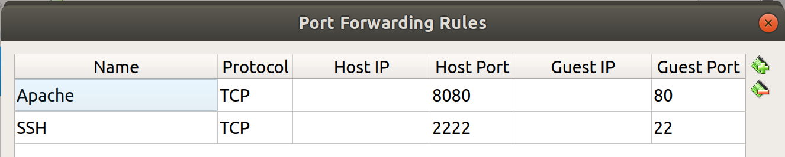

# Introduction

Traces are sequences of low-level events comprising a name and multiple arguments including a timestamp, a process id, and a return value, depending on the event. Their analysis helps uncover intrusions, identify bugs, and find latency causes; however, their effectiveness is hindered by omitting the event arguments.

To the best of our knowledge, no massive and modern datasets comprising the system call arguments are publicly available. To that extent, we propose to generate such a dataset using web requests.

On the client-side, a benchmark is used to send many concurrent requests to the server via the hypertext transfer protocol (HTTP). We chose [wrk2](https://github.com/giltene/wrk2), the open-source multithreaded equivalent of the Apache benchmark. It guarantees a constant throughput load with an accuracy up to 99.9999% for sufficiently long runs. Moreover, wrk2 yields a latency summary which allows extracting statistics about the dataset without processing it. 

On the server side, a web server is used to handle client requests. Web servers store, process, and deliver web pages to clients. We chose [Apache2](https://httpd.apache.org/) for its omnipresence and its modularity. Indeed, Apache2 is the most popular web server since 1996; its vast community has developed many optional modules, including app servers and database connection managers.

In order to increase the likelihood of abnormal requests, the server must be overloaded which is done restricting the amount or speed of the resources (CPU, memory, network, and disk). Consequently, Apache2 is deployed in a virtual machine (VM) using [Virtual Box](https://www.virtualbox.org/).

In this work, we focus on the server side given that it is the source of most delays. A single trace is collected during the entire benchmark; therefore the trace contains many individual requests. Several tracers are available; however, [LTTng](https://lttng.org/) is often the tracer of choice for performance anomalies as it is light and fast. All system calls and scheduler events are enabled in order to have a complete view of the system. 

[Babeltrace](https://babeltrace.org/) is a library written in C that reads the common trace format. We chose Babeltrace not only for its efficiency but also for its convenience. Indeed, the available Python bindings allow opening a trace as a collection of events, which is then converted into a generator of dictionaries. Individual requests are intrinsically delimited by the system calls accpet4 and close (or shutdown). As a result, requests can be extracted and preprocessed on the fly in Python. The resulting dataset comprises individual requests, i.e., variable size sequences of system calls that are represented as dictionaries.

# How to Set up the Client-Server 

### How to Set up the Web Server

1. Install [Virtual Box](https://www.virtualbox.org/) and create a VM.

2. Configure network:
    - Set the first network card as "NAT"
    - In "Advanced", check "Cable Connected"
    - Add two port forwarding rules:\
    

3. Start the VM and install [Ubuntu Server 18.04](https://ubuntu.com/download/server) **with OpenSSH**    

4. Install and configure [Apache2](https://httpd.apache.org/):
    - Install Apache2:
        ```bash
        apt-get update
        apt-get upgrade -y
        apt install -y apache2
        ufw allow 'Apache'
        ```
    - Install PHP:
        ```bash
        apt-get install -y php libapache2-mod-php
        ```
    - Enable PHP:
        ```bash
        a2enmod php7.2
        ```
    - Create the directory for your domain:
        ```bash
        mkdir /var/www/benchmark
        ```
    - Assign ownership of the directory:
        ```bash
        chown -R $USER:$USER /var/www/benchmark
        ```
    - Make sure the permission are correct:
        ```bash
        chmod -R 755 /var/www/benchmark
        ```
    - Create a random page:
        ```bash
        nano /var/www/benchmark/index.php
        ```
    - Inside, add the following code:
        ```http
        <head></head>
        <body>
        Hello, the random actor is:<br>
        <?php
            $id = rand(1, 65535);
            $db = new PDO('mysql:host=localhost;dbname=sakila;charset=utf8', 'user', 'password');
            $author = $db->query("SELECT first_name, last_name FROM actor where actor_id=$id");
            while($row = $author->fetch(PDO::FETCH_ASSOC)) {
                echo "   First name:{$row['first_name']}  <br>";
                echo "   Last name:{$row['last_name']}  <br>";
            }
        ?>
        </body>
        </html>
        ```
    - Make a new virtual host file:
        ```bash
        nano /etc/apache2/sites-available/benchmark.conf
        ```
    - Paste in the following configuration block:
        ```
        <VirtualHost *:80>
            ServerAdmin webmaster@localhost
            ServerName benchmark
            ServerAlias benchmark
            DocumentRoot /var/www/benchmark
            ErrorLog ${APACHE_LOG_DIR}/error.log
            CustomLog ${APACHE_LOG_DIR}/access.log combined
        </VirtualHost>
        ```
    - Enable the file:
        ```bash
        a2ensite benchmark.conf
        ```
    - Disable the default site:
        ```bash
        a2dissite 000-default.conf
        ```
    - Turn off persistent connections by setting `KeepAlive` to `Off` in ` /etc/apache2/apache2.conf`.
    - Restart Apache:
        ```bash
        systemctl restart apache2
        ```
    - Make sure the benchmark website is accessible from `http://@HOST:8080`

5. Install [MySQL](https://www.mysql.com/) and generate random data:
    - Install MySQL:
    ```bash
    sudo apt-get update
    sudo apt-get install mysql-server
    ```
    - If the installation does not start:
    ```bash
    sudo mysql_secure_installation utility
    ```
    - Start MySQL service and launch at reboot:
    ```bash
    sudo systemctl start mysql
    sudo systemctl enable mysql
    ```
    - Create a user:
    ```sql
    sudo mysql -u root -p
    CREATE USER 'user'@'localhost' IDENTIFIED BY 'password';
    GRANT ALL PRIVILEGES ON * . * TO 'user'@'localhost';
    exit
    ```
    - Fill MySQL with random data
    ```bash
    wget https://github.com/Percona-Lab/mysql_random_data_load/releases/download/0.1.6/mysql_random_data_loader_linux_amd64.tar.gz
    tar xzf mysql_random_data_loader_linux_amd64.tar.gz
    chmod +x mysql_random_data_loader
    wget http://downloads.mysql.com/docs/sakila-db.tar.gz
    tar xzf sakila-db.tar.gz && rm -f sakila-db.tar.gz
    mysql -u user -p < sakila-db/sakila-schema.sql
    ./mysql_random_data_loader sakila actor 65535 --host=127.0.0.1 --port=3306 --user=user --password=password
    ```

6. Install [LTTng](https://lttng.org/):
    ```bash
    apt-get install -y lttng-tools lttng-modules-dkms
    ```

7. Install the apps that will be used to create noise:
    ```bash
    apt-get install -y htop bmon firefox 
    ```

8. Create a file `noise.sh` (note you need a file that contains URLs called url.txt, e.g., http://haselgrove.id.au/wikipedia/):
    ```bash
    #!/bin/bash
    while true
    do
    line=$(shuf -n 1 url.txt)
    firefox --window-size=1280,1024 --screenshot "tmp/$line.png" "https://en.wikipedia.org/$line"
    sleep .$[ ( $RANDOM % 9 ) + 1 ]s
    done
    ```

### How to Set up the Client

1. If necessary, install dependencies:
    ```bash
    apt-get install make gcc openssl libssl-dev libz-dev
    ```

2. Clone and build [wrk2](https://github.com/giltene/wrk2):
    ```bash
    git clone https://github.com/giltene/wrk2.git
    cd wrk2
    make
    ```

# How to Collect Data

### Server Side

Create and execute the following script with administrator priviledge:

```bash
#!/bin/bash
# Create tmp folder
rm -rf tmp
mkdir tmp
# Add netwrok noise in the background
./noise.sh >/dev/null 2>/dev/null &
# Create LTTng session on the server:
read -p "Enter destination folder : " name
sudo lttng create my-session --output=$name
# Create and configure a channel with a large buffer to keep up with event thoughput:
sudo lttng enable-channel --kernel --subbuf-size=128M --num-subbuf=8 my-channel
# Create an event rule with all system calls:
sudo lttng enable-event --kernel --channel=my-channel --syscall --all
# Add process name, pid and tid in the context:
sudo lttng add-context --kernel --channel=my-channel --type=procname
sudo lttng add-context --kernel --channel=my-channel --type=pid
sudo lttng add-context --kernel --channel=my-channel --type=tid
read -p "Press enter to start tracing"
sudo lttng start
read -p "Press enter to stop tracing"
sudo lttng stop
sudo lttng destroy my-session
``` 

### Client Side

Once LTTng starts tracing on the server, start the benchmark:
```bash
./wrk -t32 -c1000 -d100s -R1000 http://@HOST:8080
```


# Requirement to Process Data

0. If needed, create the required folders
    ```bash
    mkdir logs figures models
    ```

1. Download, install, and update [conda](https://anaconda.org/):
    ```bash
    curl -O https://repo.anaconda.com/archive/Anaconda3-2019.10-Linux-x86_64.sh
    bash Anaconda3-2019.10-Linux-x86_64.sh
    source ~/.bashrc
    conda config --set auto_activate_base false
    conda update -y conda
    conda update -y conda-build
    ```

2. Create an environment with the required packages:
    ```bash
    conda create -y --name py3 python=3.8
    conda activate py3
    conda install -y numpy matplotlib scikit-learn nltk
    conda install -y pytorch torchvision cudatoolkit=10.1 -c pytorch
    ```
    
3. Make sure no conda environment is enabled:
    ```bash
    conda deactivate
    ```

4. Install dependencies:
    ```bash
    apt-get install uuid-dev automake autoconf libtool bison flex swig asciidoc libpopt-dev

    ```

5. Dowload, configure, build, and install [Babeltrace](https://babeltrace.org/) 1.5.8:
    ```bash
    wget https://www.efficios.com/files/babeltrace/babeltrace-1.5.8.tar.bz2
    tar xjf babeltrace-1.5.8.tar.bz2
    cd babeltrace-1.5.8
    export PYTHON=/home/quentin/anaconda3/envs/py3/bin/python3.8
    export PYTHON_CONFIG=/home/quentin/anaconda3/envs/py3/bin/python3.8-config
    ./configure --enable-python-bindings --disable-debug-info
    make
    make install
    ```

6. Add symbolic link to Babeltrace Python bindings:
    ```bash
    ln -s /usr/local/lib/python3.8/site-packages/babeltrace ~/anaconda3/envs/py3/lib/python3.8/site-packages/
    ln -s /usr/local/lib/python3.8/site-packages/babeltrace-1.5.8-py3.6.egg-info ~/anaconda3/envs/py3/lib/python3.8/site-packages/
    ```

0. (Not yet used) Clone, configure, build, and install [Babeltrace](https://babeltrace.org/) 2.0:
    ```bash
    git clone https://github.com/efficios/babeltrace.git
    cd babeltrace
    ./bootstrap
    ./configure --enable-python-bindings --disable-debug-info
    make
    make install
    export LD_LIBRARY_PATH=$LD_LIBRARY_PATH:/usr/local/lib
    ```

0. Add symbolic link to Babeltrace 2 Python bindings:
    ```bash
    ln -s /usr/local/lib/python3.6/dist-packages/bt2-2.1.0_rc1-py3.6.egg-info ~/anaconda3/envs/py3/lib/python3.8/site-packages/
    ln -s /usr/local/lib/python3.6/dist-packages/bt2 ~/anaconda3/envs/py3/lib/python3.8/site-packages/
    ```
